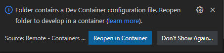
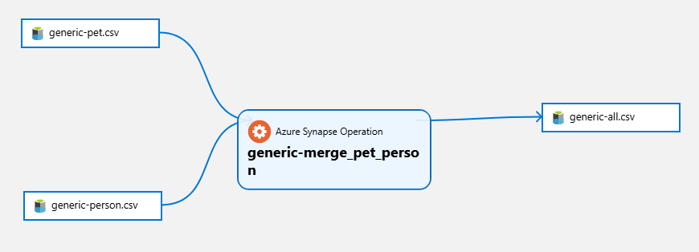

# Deploying Purview Lineage

## Introduction

This document describe how to deploy Microsoft Purview lineages based on 2 datasets:
- a generic dataset with CSV files

## Getting Started

In order to deploy Purview lineages you need to use Visual Studio Code and dev container.

### Using Visual Studio Code and Dev Container

1. Launch Visual Studio Code in the folder where you cloned the 'ps-data-foundation-imv' repository

    ```bash
        c:\git\dataops> code .
    ```

2. Once Visual Studio Code is launched, you should see the following dialog box:

    

3. Click on the button 'Reopen in Container'
4. Visual Studio Code opens the Dev Container. If it's the first time you open the project in container mode, it first builds the container, it can take several minutes to build the new container.
5. Once the container is loaded, you can open a new terminal (Terminal -> New Terminal).
6. And from the terminal, you have access to the tools installed in the Dev Container like az client,....

    ```bash
        vscode ➜ /workspaces/purview-automated (main) $ az login
    ```
### Connection to Azure Subscription

1. In order to deploy the Purview lineages, you need first to be connected to your Azure Subscription where your Purview Account and your Azure Storage is deployed. Run the command 'az login' to establish the connection with Azure Subscription.

    ```bash
        vscode ➜ /workspaces/purview-automated (main) $ az login
    ```
2. You are now ready to upload the test datasets and the create the lineages.

## Deploying generic dataset and lineage from the dev container

The Dev Container is now running, you can use the bash file [./infra/deploy-generic-data.sh ](../../infra/deploy-generic-data.sh ) to:

- upload the generic dataset on your Azure Storage Account

The generic dataset is available here [./infra/data/generic ](../../infra/data/generic)

Below the list of arguments associated with 'deploy-generic-data.sh ':
- --storage-account  Sets the storage account name
- --container  Sets the container where the dataset will be uploaded.

1. Once you are connected to your Azure subscription, you can now upload the generic dataset on the storage account under the container associated with option --container. If the container doesn't exist, it's created.

    ```bash
    vscode ➜ /workspaces/purview-automated (main) $ ./infra/deploy-generic-data.sh --storage-account sadataflowsmyco --container generic
    ```
2. Now, the dataset is loaded. You can now create the lineage, you can use the bash file [./infra/deploy-generic-lineage.sh ](../../infra/deploy-generic-lineage.sh ). Below the list of arguments associated with 'deploy-generic-lineage.sh':
    - --purview-account  Sets the storage account name
    - --storage-account  Sets the storage account name
    - --container  Sets the container where the dataset will be uploaded.

    To create the generic lineage you can use the command below:

    ```bash
    vscode ➜ /workspaces/purview-automated (main) $ ./infra/deploy-generic-lineage.sh  --purview-account dataflows-purview-test-myco --storage-account sadataflowsmyco --container generic
    ```

3. Once the lineage is created, open the Purview portal (https://web.purview.azure.com/) to display the lineage. Navigate to the home page and click on the button 'Browse assets'.

4. Check whether you find assets whose name start with the container name. Select the asset, on the asset page select the 'Lineage' tab, you should see the lineage diagram on the portal.




## Deploying generic dataset and lineage from a Synapse Notebook

In this repository, you'll find a sample [Custom Generic Lineage Notebook](./Purview_Generic_Lineage.ipynb) to create a Custom Generic Lineage in Purview


To run this notebook, you need

1. Create a Service Principal with Contributor Role at Subscription Level and the 'Data Curators' on the main Purview collection.
    ```bash
        az ad sp create-for-rbac --name "[ServicePName]" --role contributor --scopes /subscriptions/[subscriptionId]/resourceGroups/[ResourceGroupName] --sdk-auth
    ```

2. Store Service Principal Tenant Id (SP-TENANT-ID), Client Id (SP-CLIENT-ID) and Client Secret (SP-SECRET) in Key Vault

3. Upload the Python Packages (pyapacheatlas) in Synapse Workspace and then in Spark Pool. This step is mandatory if the Spark pool is isolated with no internet access.

    A. Download the python package pyapacheatlas and its dependencies using the command below:

    ```bash
        pip download pyapacheatlas==0.16.0 --python-version 3.10 --platform manylinux2014_x86_64 --only-binary=:all: -d wheelhouse_job
    ```

    B. Upload the downloaded packages into Synapse Workspace with Synapse Portal in Manage main menu and Workspaces package

    C. Upload the packages to Spark Pool with Synapse Portal in Manage main menu and 'Apache Spark Pools' tab, select your pool and click on the '...' contextual menu and select the 'Packages' submenu.

4. Import the Synapse Notebook 'Purview_Generic_Lineage' using the Synapse Portal. Select 'Develop' main menu, click on the '+' menu and select 'Import' command, select the file 'Purview_Generic_Lineage.ipynb'. Click on 'Publish All' to validate the notebook creation.

5. Before running the notebook, select your Spark Pool and language 'PySpark (Python)'. Ensure the session will run as 'Using Managed Identity' in selecting 'Run as Managed Identity' in the 'Configure Session' page.

6. Run the notebook to start the PySpark session.


## Deploying generic dataset and lineage from a Synapse Job in private infrastructure

In this repository, you'll find the source code of a sample Synapse job  [privatepurviewlineage.py](./jobs/purview/privatepurviewlineage.py) create a Custom Generic Lineage in Purview

To run this job you need

1. Create a Service Principal with Contributor Role at Subscription Level and the 'Data Curators' on the main Purview collection.
    ```bash
        az ad sp create-for-rbac --name "[ServicePName]" --role contributor --scopes /subscriptions/[subscriptionId]/resourceGroups/[ResourceGroupName] --sdk-auth
    ```

2. Store Service Principal Tenant Id (SP-TENANT-ID), Client Id (SP-CLIENT-ID) and Client Secret (SP-SECRET) in Key Vault

3. Upload the Python Packages (pyapacheatlas) in Synapse Workspace and then in Spark Pool. This step is mandatory if the Spark pool is isolated with no internet access.

    A. Download the python package pyapacheatlas and its dependencies using the command below:

    ```bash
        pip download pyapacheatlas==0.16.0 --python-version 3.10 --platform manylinux2014_x86_64 --only-binary=:all: -d wheelhouse_job
    ```

    B. Upload the downloaded packages into Synapse Workspace with Synapse Portal in Manage main menu and Workspaces package

    C. Upload the packages to Spark Pool with Synapse Portal in Manage main menu and 'Apache Spark Pools' tab, select your pool and click on the '...' contextual menu and select the 'Packages' submenu.

4. Update the values PURVIEW_ACCOUNT_NAME, STORAGE_ACCOUNT_NAME, KEY_VAULT_NAME in the file  privatepurviewlineage.py

    ```bash
        PURVIEW_ACCOUNT_NAME = "to-be-completed"
        STORAGE_ACCOUNT_NAME = "to-be-completed"
        KEY_VAULT_NAME = "to-be-completed"
    ```
5. Upload the this file privatepurviewlineage.py into Synapse ADLS Storage Account in the container under purview folder

6. Create a Synapse Job with the command below pointing to the uploaded file:
    ```bash
        abfss://[ADLSContainerName]@[ADLSStorageAccountName].dfs.core.windows.net/purview/privatepurviewlineage.py
    ```

7. Publish the new Synapse Job
8. Submit the new Synapse Job

## Deploying generic dataset and lineage from a Synapse Job in public infrastructure

In this repository, you'll find the source code of a sample Synapse job  [publicpurviewlineage.py](./jobs/purview/publicpurviewlineage.py) create a Custom Generic Lineage in Purview

To run this job you need

1. Create a Service Principal with Contributor Role at Subscription Level and the 'Data Curators' on the main Purview collection.
    ```bash
        az ad sp create-for-rbac --name "[ServicePName]" --role contributor --scopes /subscriptions/[subscriptionId]/resourceGroups/[ResourceGroupName] --sdk-auth
    ```

2. Store Service Principal Tenant Id (SP-TENANT-ID), Client Id (SP-CLIENT-ID) and Client Secret (SP-SECRET) in Key Vault

3. Upload the Python Packages (pyapacheatlas) in Synapse Workspace and then in Spark Pool. This step is mandatory if the Spark pool is isolated with no internet access.

    A. Download the python package pyapacheatlas and its dependencies using the command below:

    ```bash
        pip download pyapacheatlas==0.16.0 --python-version 3.10 --platform manylinux2014_x86_64 --only-binary=:all: -d wheelhouse_job
    ```

    B. Upload the downloaded packages into Synapse Workspace with Synapse Portal in Manage main menu and Workspaces package

    C. Upload the packages to Spark Pool with Synapse Portal in Manage main menu and 'Apache Spark Pools' tab, select your pool and click on the '...' contextual menu and select the 'Packages' submenu.

5. Using the Synapse portal create a linked service associated with the Key Vault where the service principal secrets are stored.

6. Update the values PURVIEW_ACCOUNT_NAME, STORAGE_ACCOUNT_NAME, KEY_VAULT_NAME, KEY_VAULT_LINKED_SERVICE_NAME in the file  publicpurviewlineage.py

    ```bash
        PURVIEW_ACCOUNT_NAME = "to-be-completed"
        STORAGE_ACCOUNT_NAME = "to-be-completed"
        KEY_VAULT_NAME = "to-be-completed"
        KEY_VAULT_LINKED_SERVICE_NAME = "to-be-completed"
    ```
7. Upload the this file publicpurviewlineage.py into Synapse ADLS Storage Account in the container under purview folder

8. Create a Synapse Job with the command below pointing to the uploaded file:
    ```bash
        abfss://[ADLSContainerName]@[ADLSStorageAccountName].dfs.core.windows.net/purview/publicpurviewlineage.py
    ```

9. Publish the new Synapse Job
10. Submit the new Synapse Job
